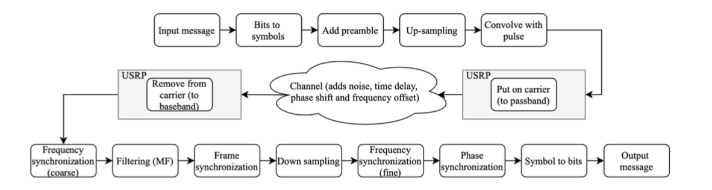

# MCC125_WirelessLinkProject
This project is aimed for designing, implementing and demonstrating a simplex wireless data transmision link over a distance of approximately 100 meters. The data is transmitted at radio frequency (RF) of 2.4 GHz, the digital modulation format used is 16QAM.  

The students were provided with programmable hardware (a software defined radio, also called USRP), which includes DA and AD convertors with a sampling rate of 400 and 100 MS/s. Matlab  is be used to set up and communicate with the USRPs and to implement the software (SW) part of the project.

In the transmitter part of the link frames are formed where each frame consists of bits for frame synchronization and the message itself. The USRP is capable of performing an IQ modulation with a center frequency of up to 100 MHz, or output baseband I and Q channels. The baseband, or the modulated IQ intermediate frequency (IF) signal, is upconverted to the chosen RF frequency, amplified and transmitted through an antenna.

On the other end of the link, a receiver amplifies and down converts the RF frequency to a baseband or IF frequency. The downconverted signal is fed to the receiving USRP. The receiving software is capable of detecting the beginning of a frame, performing necessary frequency, phase and timing synchronization and extracting the message bits.

The software part of the receiver includes implemenation of impairment correction algorithm  for frequency, timing and phase correction.

In the figure below a block diagram depicting the SW can be seen, where the transmitter is shown on top and the receiver at the bottom.

